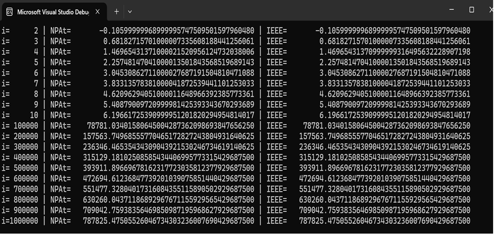

# An Alternative Algorithm for Summing Any Decimal Numbers in Binary Arithmetic

## Abstract

We propose a new number format — **NPAt** — fully compatible with conventional finite arithmetic.  
The NPAt format enables computations of decimal floating‑point numbers (represented in binary form) on an integer processor without an FPU.  
Computation results in NPAt are **bit‑identical** to those obtained using the IEEE754 binary standard.

NPAt defines two data types:  
- Numbers, consisting of exact values, approximate values, and explicit zero.  
- Non‑numbers (NaN).  

The presence of explicit zero allows bitwise comparison across the entire floating‑point range.  
NPAt forms a monotonically increasing sequence throughout the range from the minimum to the maximum possible values.  
It also allows representation of positive and negative numbers whose magnitudes are smaller than the minimum representable value.  
Such numbers can be considered infinitesimal, but not equal to zero.  

Parameters representing signed NPAt numbers are integers or zero, so all computations can be performed in two’s complement code.  
When summing numbers in NPAt format, normalization is not required.  
The NPAt format has no concept of subnormal numbers, eliminating the need for special handling.  
Finally, the precision parameter in NPAt does not affect the computation algorithm.

## Theoretical Foundations of NPAt

Any number **X** can be represented as an infinite integer **K** (0 ≤ K < ∞) of infinitesimal intervals **ɛ**.

The interval **ɛ** can be a decimal **ɛ₁₀** or binary **ɛ₂** number, or, in general, a number in any number system.

For a finite decimal **X**, the equality holds: **X = S·K₁₀·ɛ₁₀**, where **S = 1** or **−1**, **K₁₀** and **ɛ₁₀** — decimal numbers.

For a finite binary **Y**, the equality holds: **Y = S·K₂·ɛ₂**, where **S = 1** or **−1**, **K₂** and **ɛ₂** — binary numbers.

As **ɛ₁₀ → 0** and **ɛ₂ → 0**, **K₁₀ → ∞** and **K₂ → ∞**, and then **S·K₁₀·ɛ₁₀ = S·K₂·ɛ₂**. That is, for any infinitely precise decimal **X** there exists a binary **Y** that is infinitely precisely equal to **X**.

Any finite decimal or binary **K** (except **K = 0**) contains a certain number **j** of significant digits.

Significant digits are all non-zero digits in **X**, starting from the first non-zero one, and trailing zeros if the number is integer. For example, 0.00123 has three significant digits, 12300 has five significant digits.

### Representation of a number in normalized exponential form in the operational register

The form of recording any **X** in exponential form, in which the first non-zero significant digit follows the radix point, is called the normalized format.

For brevity, under the abbreviation "NF X" we will understand — the format of the number **X** in normalized form.

NF **X** is written as  
**X = S·0.K·β^e**  

where **0.K** — mantissa, **K** — integer consisting of **j** significant digits of the number written in natural form, **β** — number system (base), **e** — exponent determining the position of the radix point in **X** represented in natural form relative to the position of the radix point in **X** written in exponential form.

For example, for 0.001234, **j = 4**, then **K = 1234**, and NF **X** = 0.1234·10⁻².

For **X** in NF, where **K** is an integer with **j** significant digits, the inequality holds:  
**β^(j−1) ≤ K < β^j − 1**.

Since **K ≠ 0**, **K = 0** is a special case for such representation.

For **X** represented in NF, four areas are allocated in the operational register — **S**, **p**, **s**, **w**. One digit is allocated for the sign **S** of the number, **p** digits for **K̃** which is the closest to **K**, one digit **s** for the sign of the exponent **e**, and **w** digits for the exponent **e**.

The location of the areas in the register can be arbitrary and depend on the implementation.

The maximum integer that can be written into the **p**-digit area of the register is **K̃_max = β^p − 1**.

The maximum integer that can be written into the **w**-digit area of the register is **e_max = β^w − 1**.

If all **j** digits of **K** of NF **X** fit into the **p**-digit area of the register, and all digits of its exponent **e** fit into the **w**-digit area, then such **X** is called representable. For representable numbers — **K ≤ K̃_max** and **e ≤ e_max**.

If **K > K̃_max**, then **K** cannot be written into the **p**-digit register without losing least-significant digits and/or if **e > e_max**, then all digits of the exponent **e** of NF **X** cannot be written into the **w**-digit area. In this case, **X** is a non-representable number.

If **K > K̃_max**, **e < e_max**, then to write the value of **K** into the **p**-area of the register, it is necessary to reduce the number **j** of digits in **K** by rounding it to the closest **K̃** with **p** significant digits.

For example, if **p = 2**, then for **X = 0.1234·10⁻³**, where **K = 1234** has **j = 4** digits, after rounding to **p = 2** significant digits **K̃ = 12** and **X̃ = 0.12·10⁻³**.

If **e > e_max**, then **X̃** is sometimes considered infinitely large.

In the IEEE 754 standard, infinitely large numbers — ±∞ — are encoded with a special number.

### NPAt format

Assume we have NF **X̃ = S·0.K̃·β^e**, in which **K̃** contains **p** digits.

As described above, this number is written into the operational register in four areas — (**S**, **p**, **s**, **w**).

It is assumed that the radix point in NF **X̃** is placed before the most significant non-zero digit **K̃**. In this case, the fractional **0.K̃** contains **p** digits.

If we assume that the radix point is placed after the least-significant digit of the integer **K̃**, then to keep the value of **X̃** unchanged, the exponent **e** must be decreased by **p**. **X** will now look like  
**X̂ = S·K̂·β^(e−p)**

Assume that the radix point in the **p**-area of the register is placed after the digit with number **t ≤ p**. Where **t** is counted from left to right from the first most significant digit of the **p**-area of the register. Then, to keep the value of **X** unchanged, the exponent **e** in the normalized **X̃** must be decreased by **t**. **X** will now be represented as  
**X = S·K′·β^(e−t)**

In this expression, **K′ < K** will contain an integer non-zero part with **j** digits, the number of which coincides with the number of digits in the **t**-area of the operational register. Round **K′** to the closest integer **K̂**. The result will be  
**X̂ = S·K̂·β^(e−t)**,  
which will be the closest to **X** with **j** significant digits.

Note that the radix point is defined not by the number of digits **j** in **K̂**, but by the number of digits **t** in the **t**-area of the operational register. This is explained by the fact that in arithmetic transformations there can be cases when **j < t**. For example, when subtracting numbers close in value.

For example, assume that calculations are performed with precision up to **t = 3** significant digits in a decimal operational register with **p**-area, in which **p = 4**. Suppose further that after an arithmetic operation we obtain the number **X = 0.012·10⁻²**, in which **K̂ = 12** contains **j = 2** significant digits and **e = −2**. Then **X̂ = 012·10^(-2 −3) = 012·10⁻⁵**.

The number written into the operational register **X̂** with integer **K̂**, in which there can be **t − j** leading zeros, can be considered a number with the radix point after the **t**-th digit. **X̂** will be briefly called a number with point after **t** (NPAt).

Thus, the first **t** digits in the **p**-area of the operational register form the **t**-area of the register for writing **K̂** with the number of **j ≤ t** digits.

By setting **t < p**, we thereby reduce to **t** the number of digits in the **p**-area of the operational register by which **X** can be represented, while maintaining the maximum reliability of **j** digits in **K̂**.

This allows easy organization of processing numbers with different precision **t ≤ p** on the same operational register with **p**-area.

Denote **q = (e − t)**. Then **X̂** can be written as  
**X̂ = S·K̂·β^q**.

The coefficient **q** determines the maximum number of **j** significant digits of NF **X** that can be written into **t** digits of the **p**-area of the operational register.

For example, let **t = 2**, then for **X = 0.1234·10⁻³**, **q = −3 − 2 = −5**. Consequently **X̂ = 12·10⁻⁵**, where **K̂ = 12** contains **j = 2** digits.

The coefficient **q** will be called the rounding coefficient (RC).

Denote  
**μ = β^q**.

Then **μ** can be interpreted as the scaling factor, and then NPAt can be written as  
**X̂ = S·K̂·μ**.

In the operational register for writing **X̂**, as well as for NF **X̃**, four areas are allocated — **S**, **p**, **s**, **w**. The sign of the number **X** is written into area **S**; **j** digits of the integer coefficient **K̂** or zero are written into the **t**-area of the operational register; the sign of RC **q** is written into area **s**; RC **q** is written into **w**.

These parameters determine the value of NPAt — **X̂ = S·K̂·μ**.

If there were no losses of non-zero significant digits when rounding **K′**, then NPAt is an exact number, which we will denote by the symbol **X̄**. Exact **X̄** are a subset of NPAt **X̂**.

In general, **K̂** during calculations can have **0 ≤ j ≤ t** digits and can take any integer value in the interval  
**0 ≤ K̂ < K̂_max**  
where **K̂_max = β^t − 1**.

**Examples:**
1. If in natural form **X = 0.0123**, then in normalized form **X = 0.123·10⁻¹**. For **t = 2** we will have RC **q = −1 − 2 = −3** and then **μ = 10⁻³**. The result is NPAt **X̂ = 12·10⁻³**.
2. For **X = 12000** in normalized form **X = 0.120·10⁵**. For **t = 2** we will have RC **q = 5 − 2 = 3** and then **μ = 10³**. The result is NPAt **X̄ = 12·10³**.
3. For **X = 2** in normalized form **X = 0.200·10¹**. For **t = 3** we will have RC **q = 1 − 3 = −2**, **μ = 10⁻²**. And since there was no rounding, NPAt will be exact **X̄ = 200·10⁻²** or **X̄ = 2**.

### Properties of NPAt and NF

According to the definition, any NF **X = S·K·β^e**, represented as NF **X̃ = S·0.K̃·β^e**, lie in the range  
**0.1·β^emin ≤ X < K̃_max·β^emax**

If in NF **e < e_min**, **K̃ < 1**, **K̃ ≠ 0**, then such NF is considered a subnormal number. In a subnormal number, at least one leading digit in **K̃** is zero.

For subnormal numbers **K̃_min = 1**, so they lie in the range  
**β^emin ≤ X < 0.1·β^emin**

Thus, any NF **X**, taking into account subnormal numbers, can be represented as NF **X̃** with **K̃** lying in the range  
**1 ≤ K̃ < K̃_max**

Normalization of subnormal numbers with simultaneous correction of the exponent **e** leads to the case **e < e_min**, as a result of which the **w**-area of the exponent of the operational register overflows and normalization is required. To avoid this, subnormal numbers are rounded during calculations but not normalized.

Special algorithms different from the main algorithm for NF are used for operations with subnormal numbers. This complicates hardware and software processing of NF. In some applications, for simplicity and speed of calculations, developers refuse to work with subnormal numbers. This narrows the range of processed numbers.

The maximum value that can be written into the **w**-digit area of the operational register is  
**W = β^w − 1.**

Consequently, the maximum value that can be written into the **w**-digit area of the operational register for NF **X̃** is  
**e_max = W,**  

and, taking into account the sign **s**, the minimum exponent value will be  
**e_min = −e_max.**

Then the exponent **e** can take any value in the interval  
**−W ≤ e < W.**

For NPAt **X̂**, the RC **q** is written into the **w**-digit area of the operational register, which also takes any value in the interval  
**−W ≤ q < W.**

Since **e_max** can be written into **W**, then  
**−e_max ≤ q < e_max**

Since **q = e − t**, the inequality holds for RC **q**  
**−(e_max + t) ≤ q ≤ e_max − t.**

Hence it follows that the values of RC **q**, written into the **w**-area of the operational register, set the position of the radix point in NPAt **X̂** relative to NF **X̃** shifted **t** digits to the left.

**Example.**
1. Let **t = 2**, **e_max = 3**, then for **X = 0.234·10⁻³** we will have **X̃ = 0.23·10⁻³**, whence **q_max = −3 − 2 = −5**. Consequently, NPAt **X̂ = 23·10⁻⁵** can be taken as an infinitely large number.
2. Let **t = 2**, **e_max = 3**, then for **X = 0.234·10⁵** we will have **X̃ = 0.23·10⁵**. In this case, NF **X̃** will be considered an infinitely large number. At the same time **q_max = 5 − 2 = 3** and then NPAt **X̂ = 23·10³**.

Compare the written into the **t**-area of the operational register — NF **X̃ = S·0.K̃·β^e**, where **K̃** can have leading zeros, and NPAt **X̂ = S·K̂·β^q**.

Let **K̃** be written into the **t**-area of the operational register. If we assume that the radix point is placed after the least-significant digit of the **t**-area of the operational register, then the number will be written into the **t**-area  
**K̂ = K̃**

To keep the value of NF **X̃** unchanged, we must subtract the value **t** from the exponent **e**. Then the number written into the operational register will look like  
**X̃ = S·K̂·β^(e − t)**.  
Or  
**X̃ = S·K̂·β^q**.

Thus, we have an algorithm for converting NPAt **X̂** to NF **X̃**.

For example, NPAt **X̂ = 123·10⁻²**, in which **t = 3**, **q = −2**, will be represented in NF **X̃** as **X̃ = 0.123·10¹**.

If in NF **X̃ = S·0.K̃·β^e** **e < e_min** and **K̃ = 0**, then in the IEEE 754 standard such **X̃** is taken as ±0. The standard lacks representation of explicit exact zero.

In arithmetic, exact zero arises only when subtracting equal exact numbers. In any other operations involving inexact arguments, the resulting zero cannot be exact.

The encoded signed zero in NF leads to ambiguity in performing some arithmetic operations, for example — 1/+0 and 1/−0. If +0 and −0 are not equal to exact zero, then 1/+0 = +∞ and 1/−0 = −∞. At the same time, for exact zero it should be — 1/0 = NaN.

In NPAt **X̂**, explicit exact zero is obtained when subtracting equal exact **X̄**. Therefore, in the case when during calculations with exact values **X̄** we obtain **K̄ = 0**, then **X̄** is a number exactly equal to zero.

If during calculations at least one **X̂** is inexact, then the obtained **X̂** with **K̂ = 0** will be close, but not equal to zero, number. Such a number, by analogy with infinitely large, can be called — infinitely small.

By their nature, signed zeros in the IEEE 754 standard are positive (+0) and negative (−0) infinitely small numbers.

Thus, in NPAt **X̂** there is no ambiguity in arithmetic operations and the following relations are true — **a/+0 = +∞** and **a/−0 = −∞**, **a/0 = NaN**, where **a ≠ 0**.

### Comparison of Summation Results for NF Numbers and Numbers in NPAt Format

For example, Table 1 shows sums **X = X₁ + X₂** of some decimal numbers **X₁** and **X₂**, represented in normalized form — **X̃₁**, **X̃₂** and in NPAt format — **X̂₁** and **X̂₂**.

**Table 1.** β = 10, t = 2, W = 3

<table>
  <tr>
    <td colspan="4" align="center"><b>Sum of normalized numbers</b></td>
    <td colspan="4" align="center"><b>Sum of numbers in NPAt format</b></td>
  </tr>
  <tr>
    <td><b></b></td>
    <td>1</td>
    <td>2</td>
    <td>3</td>
    <td>4</td>
    <td>5</td>
    <td>6</td>
    <td>7</td>
  </tr>
  <tr>
    <td><b>1</b></td>
    <td>X̃₁</td>
    <td>X̃₂</td>
    <td>X̃₁ + X̃₂</td>
    <td>q₁ = e₁−t</td>
    <td>X̂₁</td>
    <td>X̂₂</td>
    <td>X̂₁ + X̂₂</td>
  </tr>
  <tr>
    <td>2</td>
    <td>0.23·10⁻¹</td>
    <td>0.01·10⁻¹</td>
    <td>0.24·10⁻¹</td>
    <td>-3</td>
    <td>23·10⁻³</td>
    <td>1.2·10⁻³</td>
    <td>24·10⁻³</td>
  </tr>
  <tr>
    <td>3</td>
    <td>0.12·10³</td>
    <td>0.23·10³</td>
    <td>0.35·10³</td>
    <td>1</td>
    <td>12·10¹</td>
    <td>23·10¹</td>
    <td>35·10¹</td>
  </tr>
  <tr>
    <td>4</td>
    <td>0.12·10⁻¹</td>
    <td>−0.12·10⁻¹</td>
    <td>(+0)</td>
    <td>-3</td>
    <td>X̄₁ = 12·10⁻³</td>
    <td>X̄₂ = −12·10⁻³</td>
    <td>0</td>
  </tr>
  <tr>
    <td>5</td>
    <td>0.23·10²</td>
    <td>−0.22·10²</td>
    <td>0.10·10¹</td>
    <td>0</td>
    <td>23·10⁰</td>
    <td>−22·10⁰</td>
    <td>1·10⁰</td>
  </tr>
  <tr>
    <td>6</td>
    <td>0.12·10⁵(+∞)</td>
    <td>0.23·10³</td>
    <td>(+∞)</td>
    <td>3</td>
    <td>12·10³</td>
    <td>0.00·10³</td>
    <td>12·10³</td>
  </tr>
  <tr>
    <td>7</td>
    <td>0.12·10⁻³</td>
    <td>0.23·10⁻³</td>
    <td>0.35·10⁻³</td>
    <td>-5 < −W</td>
    <td>(+0)</td>
    <td>(+0)</td>
    <td>(+0)</td>
  </tr>
  <tr>
    <td>8</td>
    <td>0.12·10⁶(+∞)</td>
    <td>0.23·10³</td>
    <td>(+∞)</td>
    <td>4 > W</td>
    <td>(+∞)</td>
    <td>0.0023·10³</td>
    <td>(+∞)</td>
  </tr>
</table>

In the columns and rows of Table 1 for NF numbers, the following cases are presented:
- Column 1 contains NF **X̃₁** with **j = t = 2** significant digits.
- Row 6, column 1 presents the case when NF **X̃₁** has exponent **e₁ > W**, which does not fit into the **w**-area of the operational register. This is a special case — +∞.
- Row 8, column 1 presents the case when **e₁ > W**. This is also a special case (SC) — +∞.

- Column 2 contains values **X̃₂**, aligned to exponent **e₁** and rounded to the first **t = 2** digits after the radix point.

- Column 3 contains normalized sums **X̃₁ + X̃₂** with rounding to the first **t = 2** digits.
- Row 4, column 3 shows the result of subtracting identical numbers. The mantissa of the sum is (+0).
- Row 6, column 3 shows that since one of the exponents, in our case exponent **e₁ > W**, the sum is a special case — (+∞).
- Row 8, column 3 also shows that since one of the addends, namely **X̃₁**, is a special case — (+∞), the sum is also a special case — (+∞).

In the columns and rows of Table 1 for NPAt, the following cases are presented:
- Column 4 contains RC **q₁ = e₁ − t**.
- Row 7, column 4 denotes the case when **−q₁ < −W**.
- Row 8, column 4 denotes the case when **q₁ > W**.
- Column 5 contains NPAt **X̂₁**.
- Row 7, column 5 indicates that since **−q₁ < −W**, NPAt with **q₁ > W** does not fit into the **w**-area of the operational register, so this number is infinitely small (+0).
- Row 8, column 5 indicates that since **q₁ > W**, this number is a special case — (+∞).
- Column 6 contains NPAt **X̂₂**.
- Row 7, column 6 shows that since for NF **X̃₁** and NF **X̃₂** **e₁ = e₂**, then for both NPAt **X̂₁** and NPAt **X̂₂** **q₁ = q₂ < 0**, so NPAt **X̂₂** is (+0).
- Column 7 contains sums of NPAt **X̂₁ + X̂₂**.
- Row 7, column 7 shows that if the addends NPAt **X̂₁** and NPAt **X̂₂** are infinitely small numbers, their sum will also be infinitely small (+0).
- Row 8, column 7 shows that if at least one of the addends NPAt **X̂₁** and NPAt **X̂₂** is an infinitely large number, their sum will also be an infinitely large number (+∞).

### Summary

1. Any normalized floating-point number **X = S·0.K·β^e** can be approximately represented in the operational register with **t**-area in NF format **X̃ = S·0.K̃·μ**.
2. NF **X̃** can be represented as approximate to **X** NPAt **X̂ = S·K̂·μ**, or exact **X̄ = S·K̄·μ**, where **X̄** is a subset of NPAt **X̂**.
3. **K̂** and **K̄** — integers in the interval from 0 to **K̂_max**, which define a monotonically increasing function **X̂** from **X̂_min = β^(-q_max)** to **X̂_max = β^(q_max+t)**.
4. In NPAt format we have two data types. One — numbers, consisting of approximate numbers **X̂** and exact **X̄**, and the second — non-numbers (NaN).
5. Parameters of signed NPAt — (**S**, **K**, **s**, **e**) are integers or zero, so all computations can be performed in two's complement code.
6. If in the exact number **X̄ = S·K̄·μ** **K = 0**, then **X̄ = 0** is an explicit exact number.
7. The presence of explicit exact zero in NPAt allows implementing bit-wise number comparison in computational algorithms.
8. The presence of explicit exact zero in NPAt allows introducing the concepts of minus (−0) and plus (+0) infinitely small numbers, which is in demand in many mathematical proofs.
9. In NPAt computations, normalization is not required, as the fractional part formed by shifting **K** goes beyond the register grid and **K** is rounded to the nearest integer.
10. The computation precision **t** in NPAt is set by the user and does not affect the computation algorithm.
11. In NPAt format, the concept of subnormal number is absent, so no special means for working with such numbers are required.
12. The NPAt format allows very simple implementation of computations on CPU, yielding results identical to computations on FPU.

Below is a demonstration algorithm showing how to implement summation of arbitrary input signed numbers **x₁** and **x₂** in NPAt format on an integer processor, with the same results as when summing the same numbers in float or double format.

This is an example of one of the screenshots of computation results presented in the PowerPoint below, obtained using the demonstration algorithm.

The algorithm is implemented in C++ and available at — [NPAt-algorithm.cpp](NPAt_algorithm.cpp)

## Demo Presentation

[View NPAt Demo Presentation (PDF)](presentation.pdf)

The program performs summation  
**R = ±x₁ ± x₂·(Z−1)**.

Where the number of summation cycles **Z**, input ±**x₁** and ±**x₂** can vary arbitrarily.

It can be seen that the summation results in NPAt, at **t = 24** or **53** and arbitrary **Z**, are bit-identical to the summation results for the same numbers in float or double formats.
